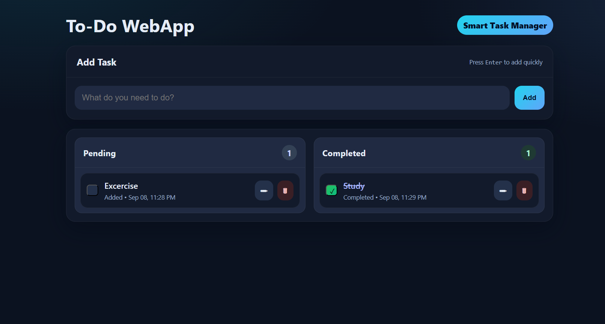

## ✅ Modern To-Do WebApp

A sleek, responsive, and interactive Task Manager Web App built with HTML, CSS, and JavaScript.
It allows users to add, edit, delete, and complete tasks with persistent storage using LocalStorage.

---

## 🚀 Live Demo

🔗 [Try it here](https://kunal-web3.github.io/OIBSIP-ToDo-WebApp-3/) 

---

## 🛠️ Tech Stack

HTML5 – semantic structure  
CSS3 – modern, responsive UI design (dark theme, gradients, shadows)  
JavaScript (ES6) – task management logic, localStorage persistence, dynamic rendering  

---

## 📂 Project Structure

📌 ToDo-WebApp/

├── index.html      # Main To-Do app UI  
├── style.css       # Modern styling (cards, buttons, dialogs, responsiveness)  
├── app.js          # Core task management logic  
├── screenshot.png  # Project preview  
└── README.md       # Project documentation  

---

## 📸 Preview :

📝 Pending & Completed Task Lists

 

---

## ✨ Features

✅ Add new tasks with one click or press Enter  
✅ Mark tasks as Completed / Pending  
✅ Edit existing tasks using a modal dialog  
✅ Delete tasks with confirmation  
✅ Task counts for Pending and Completed  
✅ Timestamps (Added / Completed) shown dynamically  
✅ Fully responsive (works on all devices)  
✅ Dark-themed modern UI with gradients & smooth transitions  
✅ Persistent storage via LocalStorage  

---

## 🎯 Learning Outcomes

Through this project, I learned:

📌 Structuring a modern To-Do App UI with HTML & CSS  
📌 Implementing CRUD operations (Create, Read, Update, Delete) in JavaScript  
📌 Handling localStorage for task persistence  
📌 Creating reusable UI components dynamically with JS  
📌 Using <dialog> for edit modals and improving UX  
📌 Designing a responsive and visually appealing dark mode interface  

---

## 🙌 Acknowledgement

Special thanks to Oasis Infobyte (OIBSIP) for the opportunity and guidance.

---

## 📢 Connect with Me  

🔗 [LinkedIn](https://www.linkedin.com/in/kunal-jadhav-kj) | 🌐 [GitHub](https://github.com/kunal-web3)

---